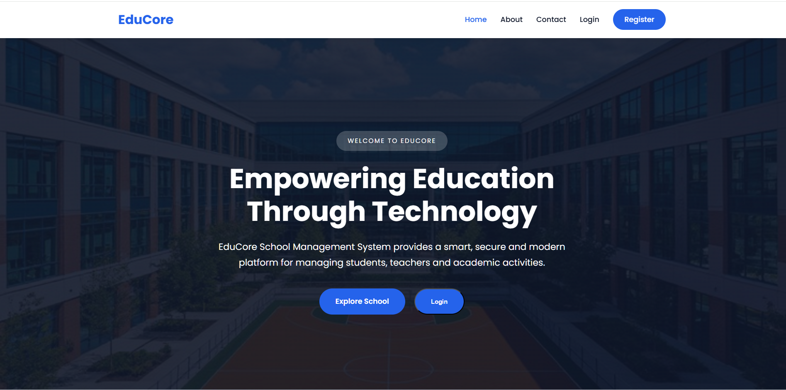
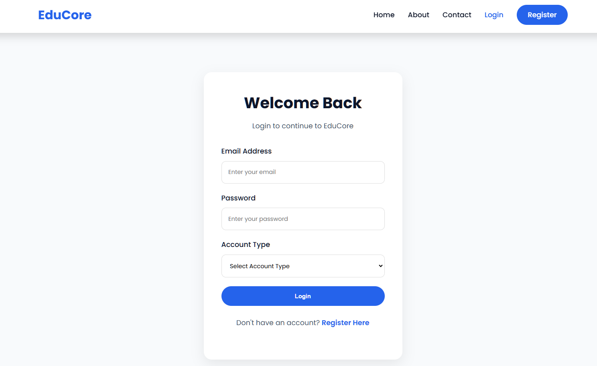
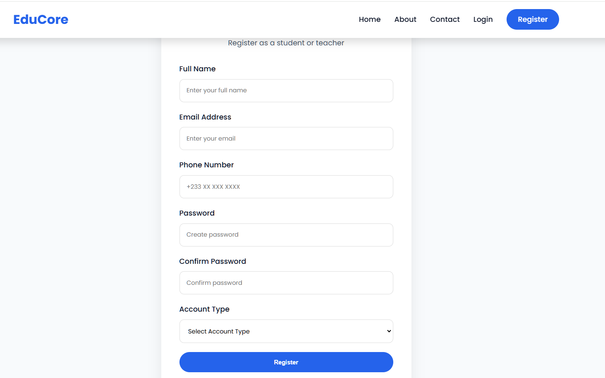

# EduCore School Management System


## Overview

**EduCore School Management System** is a modern web-based application designed to simplify and improve school administration through technology.

The system provides an organized platform for managing:

* Students
* Users
* Academic activities
* School information
* Communication processes

The project focuses on reducing manual administrative work, improving efficiency, and providing a better digital experience for school administrators, teachers, and students.

---

# Features

## Student Management

* Add new students
* View student records
* Update student information
* Delete student records
* Manage student data efficiently

---

## User Management

* User registration
* User authentication
* Login and logout functionality
* Secure access control

---

## School Information

* School homepage
* About section
* Contact information
* Campus gallery

---

## Modern Interface

* Responsive design
* Clean and user-friendly layout
* Interactive JavaScript features
* Image slider and announcements

---

# Technologies Used

| Technology | Purpose                       |
| ---------- | ----------------------------- |
| PHP        | Backend development           |
| MySQL      | Database management           |
| HTML5      | Website structure             |
| CSS3       | Styling and design            |
| JavaScript | Client-side interaction       |
| XAMPP      | Local development environment |

---

# Project Structure

```text
EduCore-School-Management-System/

│
├── images/                  # Website images
├── index.php                # Homepage
├── about.php                # About page
├── contact.php              # Contact page
├── login.php                # User login
├── register.php             # User registration
├── dashboard.php            # User dashboard
├── add_student.php          # Add student records
├── view_students.php        # View students
├── update_student.php       # Update student records
├── delete_student.php       # Delete student records
├── style.css                # Website styling
├── script.js                # JavaScript functions
└── README.md                # Project documentation
```

---

# Installation and Setup

## Requirements

Before running the project, install:

* XAMPP (Apache + MySQL + PHP)
* Web Browser
* Code Editor (Optional)

---

## Setup Steps

### 1. Clone the Repository

```bash
git clone https://github.com/dyvne/EduCore-School-Management-System.git
```

### 2. Move Project into XAMPP

Copy the project folder into:

```text
C:\xampp\htdocs\
```

### 3. Start XAMPP

Start the following services:

* Apache
* MySQL

### 4. Create Database

Create a database named:

```text
educore
```

### 5. Configure Database Connection

Create a `connection.php` file:

```php
<?php

$servername = "localhost";
$username = "root";
$password = "";
$database = "educore";

$conn = new mysqli(
    $servername,
    $username,
    $password,
    $database
);

if($conn->connect_error){

    die("Database Connection Failed: " . $conn->connect_error);

}

?>
```

### 6. Run the Application

Open your browser and visit:

```text
http://localhost/gp/
```

---

# Screenshots

# Screenshots

## Homepage



## Login Page


## Dashboard



## Student Management



# Project Objectives

* Digitize school administration processes
* Improve student record management
* Enhance communication and accessibility
* Provide a foundation for future school management solutions

---

# Future Improvements

Possible future enhancements:

* Online student portal
* Teacher management module
* Attendance tracking
* Examination and grading system
* Email notifications
* Role-based permissions
* Cloud deployment

---

# Development

This project was developed as a **School Management System** using modern web development technologies.

---

# License

This project is developed for **educational purposes**.

---

# Acknowledgements

Thanks to everyone who contributed ideas, testing, and support during the development of this project.
